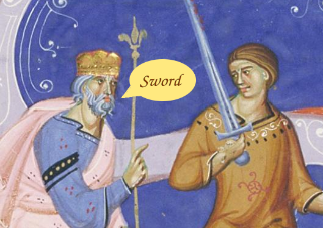

# manuscriptminiatures-tagger
Automatic tagger of manuscript miniatures objects, using machine learning

This project aims to automatically tag common objects in the minuatures at 
http://www.manuscriptminiatures.com, by means of neural networks trained using 
manual tags from the site.

Currently in its early stages, no working classifier yet.
